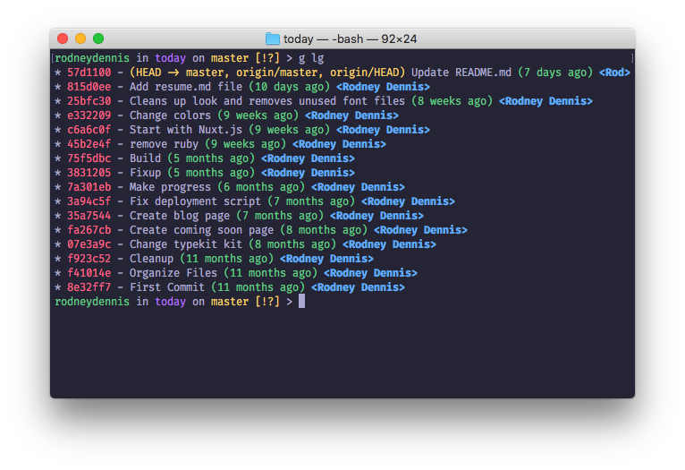

# whimsy-terminal

> A whimsical theme for macOS Terminal

## Install
1. Download [Whimsy.terminal](Whimsy.terminal)
2. Double-click downloaded file

## License
MIT @ [Rodney Dennis](https://rod.today)
