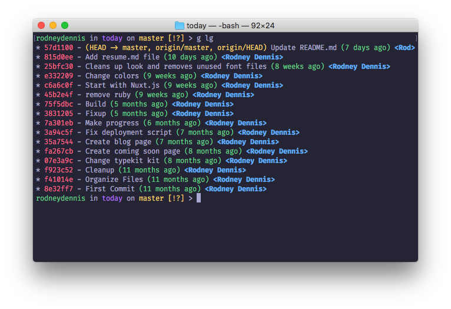

# whimsy-terminal

> A whimsical theme for macOS Terminal

## Install
1. Download [Whimsy.terminal](Whimsy.terminal)
2. Double-click downloaded file

## Related
- [whimsy-iterm2](https://github.com/rod/whimsy-iterm2)
- [whimsy-hyper](https://github.com/rod/whimsy-hyper)

## License
MIT @ [Rodney Dennis](https://rod.today)
